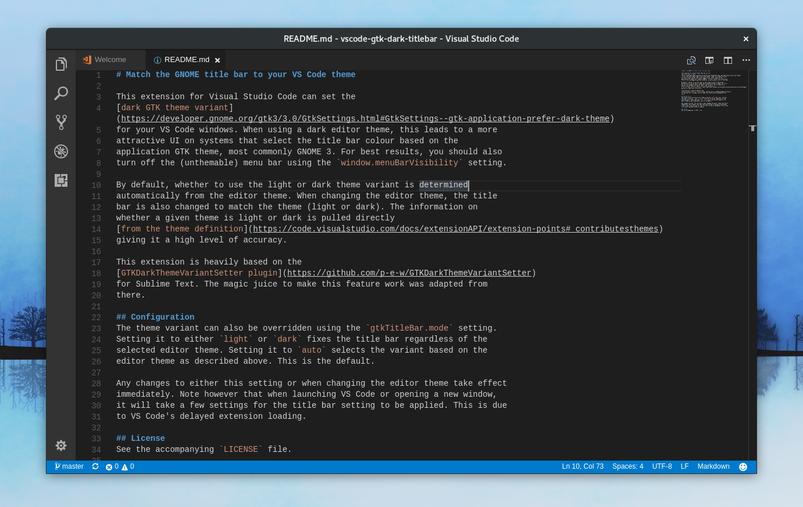

# Match the GNOME title bar to your VS Code theme

This extension for Visual Studio Code can set the
[dark GTK theme variant](https://developer.gnome.org/gtk3/3.0/GtkSettings.html#GtkSettings--gtk-application-prefer-dark-theme)
for your VS Code windows. When using a dark editor theme, this leads to a more
attractive UI on systems that select the title bar colour based on the
application GTK theme, most commonly GNOME 3. For best results, you should also
turn off the (unthemable) menu bar using the `window.menuBarVisibility` setting.

By default, whether to use the light or dark theme variant is determined
automatically from the editor theme. When changing the editor theme, the title
bar is also changed to match the theme (light or dark). The information on
whether a given theme is light or dark is pulled directly
[from the theme definition](https://code.visualstudio.com/docs/extensionAPI/extension-points#_contributesthemes)
giving it a high level of accuracy.

This extension is heavily based on the
[GTKDarkThemeVariantSetter plugin](https://github.com/p-e-w/GTKDarkThemeVariantSetter)
for Sublime Text. The magic juice to make this feature work was adapted from
there.

## Configuration
The theme variant can also be overridden using the `gtkTitleBar.mode` setting.
Setting it to either `light` or `dark` fixes the title bar regardless of the
selected editor theme. Setting it to `auto` selects the variant based on the
editor theme as described above. This is the default.

Any changes to either this setting or when changing the editor theme take effect
immediately. Note however that when launching VS Code or opening a new window,
it will take a few settings for the title bar setting to be applied. This is due
to VS Code's delayed extension loading.

## License
See the accompanying `LICENSE` file.
